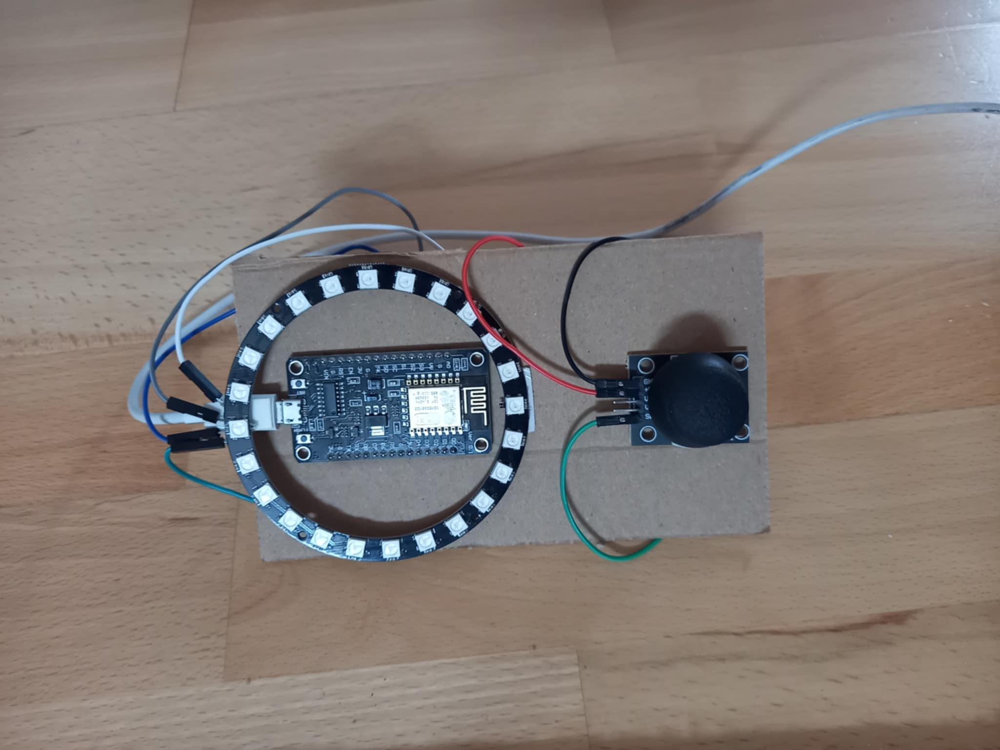
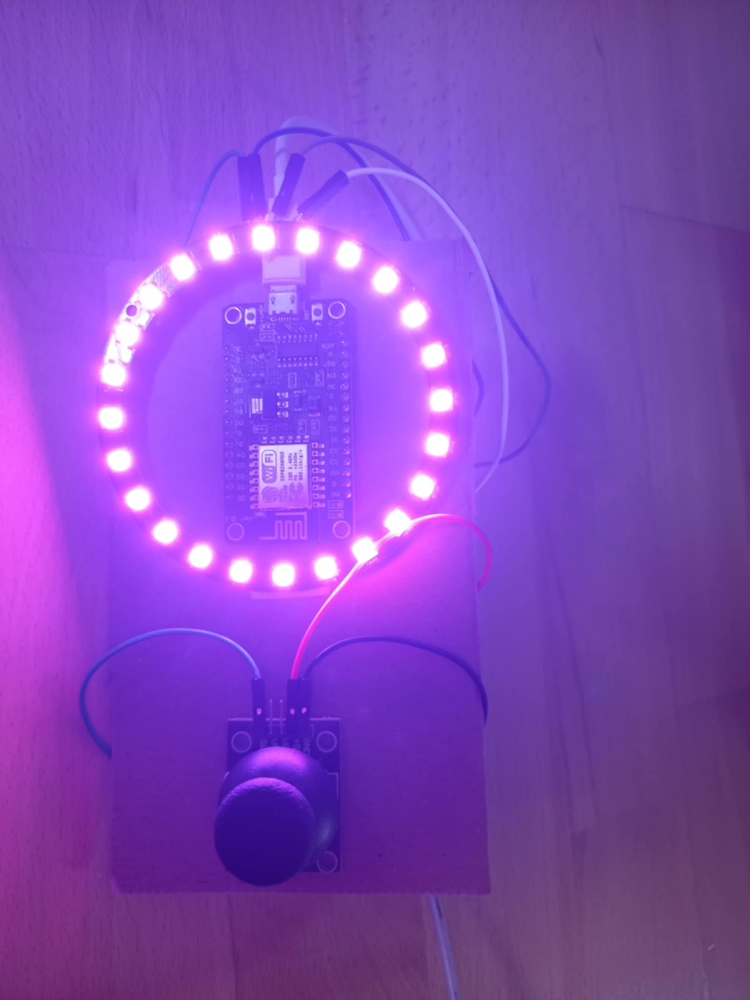

# ESP-12 controlled LED ring

This repository contains a source code for LED ring control with MCU chip.

## Functionality

The project should serve as a simple light decoration. Individual programs (animations) are switched via connected button.

## Material

- ESP12 MCU Chip (NODE MCU ESP12-E v3.0 CH340G)
- LED Ring (WS2812 5050)
- Analog Joystick
- Power Supply (for instance powerbank)
- F-F Jumper Wires
- M-F Jumper Wires

## Software Dependencies
I used Arduino libraries to support the firmware deployed on ESP12 board.

- Arduino Core
- AdaFruit NeoPixel

## Showcase

